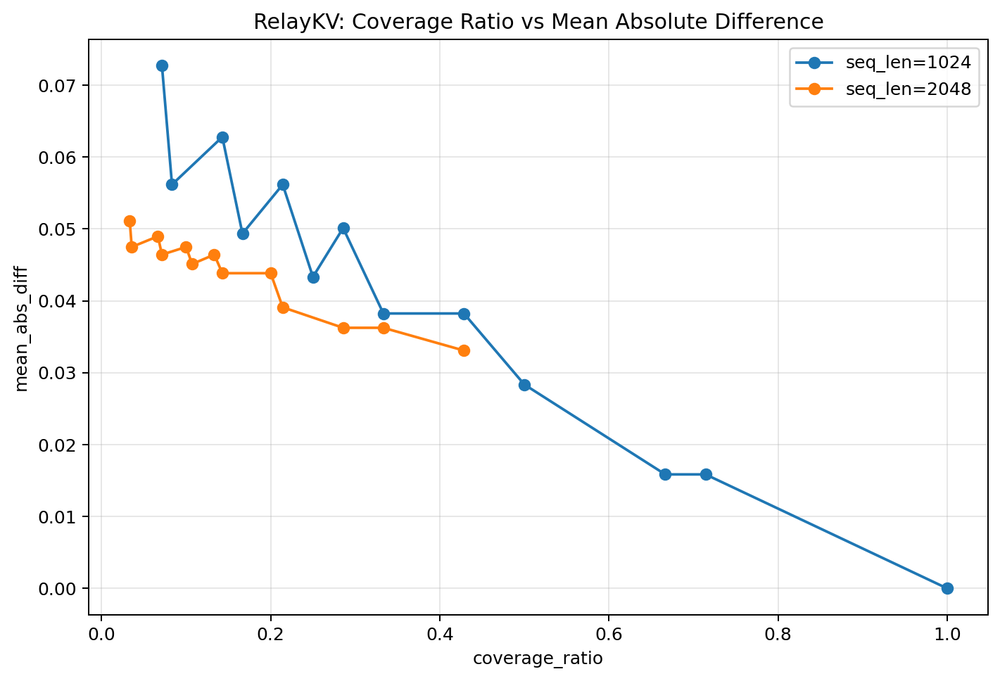

# RelayKV


**RelayKV** is a recall-aware tiered KV cache engine for long-context local LLM inference.

It re-lays cold KV cache across GPU and CPU memory tiers, recalls relevant candidates on demand, and helps local models run with longer context on limited hardware.

## Current Status

RelayKV is now a **working research prototype**.

The current prototype can:

- split KV cache into **hot** and **cold** ranges
- offload cold KV tensors to **CPU**
- split cold KV into **blocks**
- build lightweight **block metadata**
- score blocks against a query
- retrieve selected cold blocks
- build a **candidate KV**
- merge candidate KV with hot KV into a **working KV**
- compare the resulting attention output against full KV attention

This means RelayKV already supports the following end-to-end prototype path:

```text
KV split
→ CPU cold offload
→ blockify
→ metadata
→ scoring
→ retrieval
→ candidate KV
→ working KV
→ attention comparison
```

## Motivation

Long-context inference is often constrained not only by compute, but by KV cache growth.

As context length increases, KV cache becomes a dominant memory cost. This is especially problematic for local inference on commodity GPUs, where limited VRAM makes long-context workloads difficult to sustain.

RelayKV is built around a simple idea:

> not all KV entries need to remain on GPU at all times, but useful entries must remain reachable when needed.

RelayKV treats KV cache as a managed memory system rather than a fixed GPU-only artifact. It keeps hot KV close to the GPU, offloads cold KV to CPU memory, and restores only the most relevant candidates for the current query.

## What RelayKV Is

RelayKV is a **KV engine**, not a full inference runtime.

Its role is to manage how KV cache is:

- placed across memory tiers
- grouped into retrievable units
- recalled for attention
- optionally compressed in colder tiers

RelayKV is intended to sit beneath or alongside an existing inference backend.

## Prototype Architecture

```text
Application / Agent / API Server
        ↓
   Inference Runtime
        ↓
      RelayKV
   ├─ Tier split (hot / cold)
   ├─ CPU cold cache
   ├─ Cold block layout
   ├─ Block metadata
   ├─ Block scoring
   ├─ Block retrieval
   ├─ Candidate KV assembly
   └─ Working KV assembly
        ↓
   Attention Comparison / Future Re-Attention
```

## Key Prototype Results

RelayKV already supports the following prototype path:

```text
KV split
→ CPU cold offload
→ blockify
→ metadata
→ scoring
→ retrieval
→ candidate KV
→ working KV
→ attention comparison
```

In a smaller test case:

- full KV length: `386`
- working KV length: `384`

Even after dropping a small part of the cold KV, the prototype produced extremely small output differences:

- mean absolute difference: `1.46e-08`
- max absolute difference: `1.19e-07`
- L2 difference: `4.62e-07`

This is an encouraging sanity check that the end-to-end pipeline is correctly wired.

## Sweep Findings

A larger sweep on `seq_len=1024` and `seq_len=2048` at `layer_idx=27` showed a clear trend:

- approximation error decreases as **candidate coverage** increases
- larger hot windows improve stability
- different `(block_size, top_k)` pairs often produce similar error when they yield similar effective coverage

This suggests that approximation quality is explained better by **effective candidate coverage** than by execution granularity alone.

### Coverage vs. Error



**Figure 1.** Mean absolute attention-output difference as a function of candidate coverage ratio for `layer_idx=27`. The plot shows two sequence lengths (`1024` and `2048`). In both cases, approximation error decreases as coverage increases, while the longer context remains consistently harder. The overall trend supports a coverage-first interpretation of RelayKV behavior.

### Example Table

| hot_window | block_size | top_k | coverage_ratio | mean_abs_diff |
|---:|---:|---:|---:|---:|
| 128 | 64  | 1 | 0.0714 | 0.072750889 |
| 128 | 64  | 2 | 0.1429 | 0.062801488 |
| 128 | 64  | 3 | 0.2143 | 0.056178473 |
| 128 | 128 | 2 | 0.2857 | 0.050129421 |
| 128 | 128 | 3 | 0.4286 | 0.038244553 |
| 128 | 256 | 3 | 0.7143 | 0.015856747 |
| 256 | 256 | 3 | 1.0000 | 0.000000000 |

### Current Interpretation

The current prototype evidence supports the following empirical view:

- higher **coverage_ratio** generally reduces approximation error
- for matched coverage, different block sizes may behave similarly
- longer sequence lengths remain harder, but follow the same trend
- larger hot windows improve stability by preserving more recent KV directly

## Repository Structure

```text
relay-kv/
├─ README.md
├─ LICENSE
├─ docs/
│  ├─ README.md
│  ├─ experiment_spec.md
│  ├─ current_status.md
│  ├─ experimental_findings_2026-04-07.md
│  ├─ figures/
│  │  └─ relaykv_coverage_vs_error.png
│  └─ data/
│     └─ relaykv_coverage_vs_error.csv
├─ notes/
├─ relaykv/
├─ scripts/
├─ results/
└─ tests/
```

## Design Goals

RelayKV is built with the following goals:

- **practicality**: useful on real local hardware
- **modularity**: works with existing inference backends
- **efficiency**: reduce unnecessary KV residency and transfer
- **scalability**: support longer context windows through tiered storage
- **quality retention**: preserve attention quality through useful candidate recall

## Non-Goals

RelayKV is not intended to be:

- a complete LLM serving framework
- a model training system
- a replacement for all runtime optimizations
- a guarantee of exact full-attention equivalence in every setting

Its focus is narrower: efficient KV management for long-context local inference.

## Planned Next Steps

Near-term:

- expand sweeps over longer sequence lengths
- compare more layers systematically
- summarize results in compact tables and plots
- test additional scoring variants

Mid-term:

- build a cleaner single-pipeline script
- test more practical prompt sets
- scale to Qwen2.5-3B and Qwen2.5-7B

Long-term:

- quantized cold tier
- async prefetch
- backend integration
- vLLM-aware design path

## Documentation Note

Core project documents are written in English.  
Informal development notes may be written in Japanese.

## License

MIT
