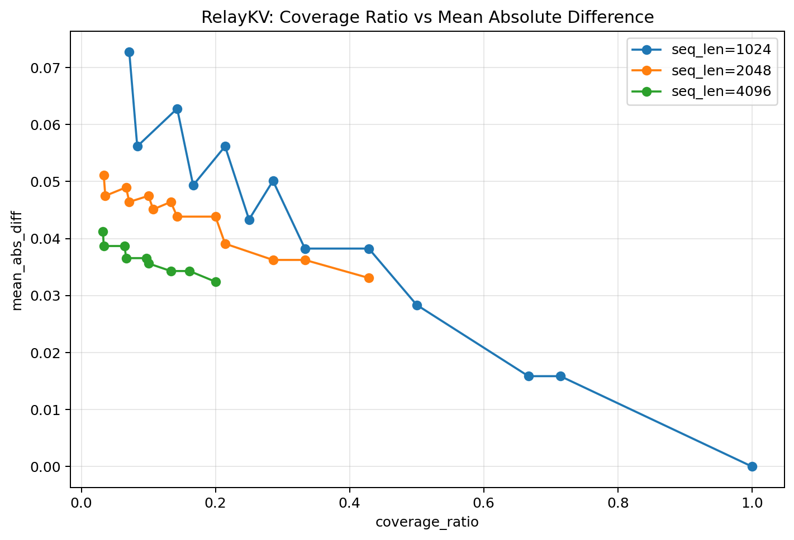
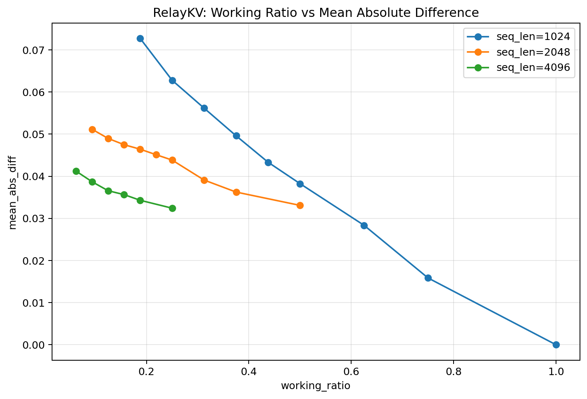
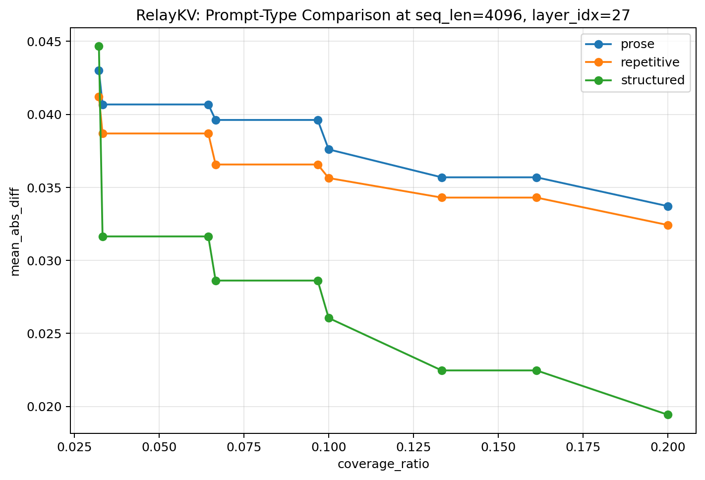
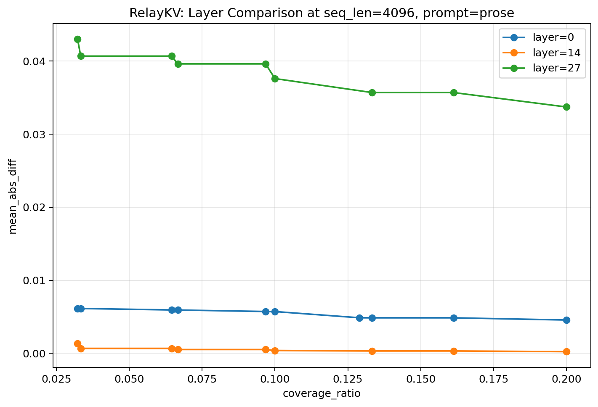

# RelayKV Experimental Findings

## Scope

This document summarizes the current prototype findings for RelayKV.

The current prototype is still small-scale, but the main empirical trend is already visible. The experiments so far focus on:

- the end-to-end RelayKV prototype path
- approximation quality relative to full KV attention
- the relationship between candidate coverage and approximation error
- behavior across multiple sequence lengths and harder layers

Unless otherwise noted, the comparisons below should be interpreted as **prototype-stage empirical findings**, not formal guarantees.

---

## Main Findings

### 1. Candidate coverage strongly affects approximation quality

Across the current sweeps, approximation error decreased as effective candidate coverage increased.

This trend remained visible at:

- `seq_len=1024`
- `seq_len=2048`
- `seq_len=4096`

and was especially informative in the harder case `layer_idx=27`.

### 2. Matched coverage often leads to similar error

Different `(block_size, top_k)` combinations often produced nearly identical errors when they yielded similar effective coverage.

This suggests that approximation quality may be explained better by **effective candidate coverage** than by block granularity alone.

### 3. Larger hot windows improve stability

Increasing the hot window generally improved stability.

This is expected, since more recent KV remains directly available and does not need to be reconstructed from cold storage.

### 4. Longer contexts remain harder, but follow the same qualitative trend

Longer sequence lengths still tend to be more challenging overall, but the same coverage-driven improvement pattern remains visible.

---

## End-to-End Prototype Path

RelayKV already supports the following prototype path:

```text
KV split
→ CPU cold offload
→ blockify
→ metadata
→ scoring
→ retrieval
→ candidate KV
→ working KV
→ attention comparison
```

This means the current findings are not based only on isolated toy components. They come from a real, connected prototype flow operating on actual KV tensors extracted from the model cache.

---

## Sanity Check: Small-Case Attention Comparison

In a smaller test case:

- full KV length: `386`
- working KV length: `384`

Even after dropping a small part of the cold KV, the prototype produced extremely small output differences:

- mean absolute difference: `1.46e-08`
- max absolute difference: `1.19e-07`
- L2 difference: `4.62e-07`

This serves as an encouraging sanity check that the end-to-end pipeline is wired correctly.

---

## Extended Comparison Across 1024, 2048, and 4096 Tokens

To test whether the same trend persists at longer sequence lengths, RelayKV was further evaluated at `seq_len=4096` while keeping the analysis focused on the harder case `layer_idx=27`.

The result remained qualitatively consistent with the earlier observations:

- approximation error decreased as effective candidate coverage increased
- larger hot windows generally improved stability
- different `(block_size, top_k)` combinations often produced similar error when they yielded similar effective coverage
- the same coverage-driven trend remained visible at `seq_len=4096`

### Coverage vs. Error (3 Sequence Lengths)



**Figure 1.** Mean absolute attention-output difference as a function of candidate coverage ratio for `layer_idx=27`, shown for `seq_len=1024`, `2048`, and `4096`. In all three cases, approximation error decreases as coverage increases. The same qualitative trend remains visible at `4096`.

### Working Ratio vs. Error (3 Sequence Lengths)



**Figure 2.** Mean absolute attention-output difference as a function of working ratio for `layer_idx=27`, shown for `seq_len=1024`, `2048`, and `4096`. This complementary view highlights the role of both selected cold candidates and preserved hot KV in the reconstructed working set.

---

## Representative Comparison Table

| seq_len | representative coverage_ratio | representative setting | mean_abs_diff |
|---:|---:|---|---:|
| 1024 | 0.0714 | hot=128, block=64, top_k=1 | 0.072750889 |
| 1024 | 0.4286 | hot=128, block=128, top_k=3 / 256,2 | 0.038244553 |
| 1024 | 1.0000 | hot=256, block=256, top_k=3 | 0.000000000 |
| 2048 | 0.0333 | hot=128, block=64, top_k=1 | 0.051156793 |
| 2048 | 0.2000 | hot=128, block=128, top_k=3 / 256,2 | 0.043847952 |
| 2048 | 0.4286 | hot=256, block=256, top_k=3 | 0.033087544 |
| 4096 | 0.0323 | hot=128, block=128, top_k=1 / 256,1 | 0.041207977 |
| 4096 | 0.0968 | hot=128, block=128, top_k=3 / 256,2 | 0.036567513 |
| 4096 | 0.2000 | hot=256, block=256, top_k=3 | 0.032424182 |

---

## Detailed Layer-27 Comparison

The current detailed comparison for `layer_idx=27` can be summarized as follows.

| seq_len | hot_window | block_size | top_k | coverage_ratio | working_ratio | mean_abs_diff | max_abs_diff |
|---:|---:|---:|---:|---:|---:|---:|---:|
| 1024 | 128 | 64  | 1 | 0.0714 | 0.1875 | 0.072750889 | 0.531370163 |
| 1024 | 128 | 64  | 2 | 0.1429 | 0.2500 | 0.062801488 | 0.449999213 |
| 1024 | 128 | 64  | 3 | 0.2143 | 0.3125 | 0.056178473 | 0.401341915 |
| 1024 | 128 | 128 | 1 | 0.1429 | 0.2500 | 0.062801488 | 0.449999213 |
| 1024 | 128 | 128 | 2 | 0.2857 | 0.3750 | 0.050129421 | 0.355480075 |
| 1024 | 128 | 128 | 3 | 0.4286 | 0.5000 | 0.038244553 | 0.268214226 |
| 1024 | 128 | 256 | 1 | 0.1429 | 0.2500 | 0.062801488 | 0.449999213 |
| 1024 | 128 | 256 | 2 | 0.4286 | 0.5000 | 0.038244553 | 0.268214226 |
| 1024 | 128 | 256 | 3 | 0.7143 | 0.7500 | 0.015856747 | 0.109682083 |
| 1024 | 256 | 64  | 1 | 0.0833 | 0.3125 | 0.056178473 | 0.401341915 |
| 1024 | 256 | 64  | 2 | 0.1667 | 0.3750 | 0.048580945 | 0.347786188 |
| 1024 | 256 | 64  | 3 | 0.2500 | 0.4375 | 0.043336678 | 0.308063030 |
| 1024 | 256 | 128 | 1 | 0.1667 | 0.3750 | 0.050129421 | 0.355480075 |
| 1024 | 256 | 128 | 2 | 0.3333 | 0.5000 | 0.038244553 | 0.268214226 |
| 1024 | 256 | 128 | 3 | 0.5000 | 0.6250 | 0.028361913 | 0.199856043 |
| 1024 | 256 | 256 | 1 | 0.3333 | 0.5000 | 0.038244553 | 0.268214226 |
| 1024 | 256 | 256 | 2 | 0.6667 | 0.7500 | 0.015856747 | 0.109682083 |
| 1024 | 256 | 256 | 3 | 1.0000 | 1.0000 | 0.000000000 | 0.000000000 |
| 2048 | 128 | 64  | 1 | 0.0333 | 0.0938 | 0.051156793 | 0.283365488 |
| 2048 | 128 | 64  | 2 | 0.0667 | 0.1250 | 0.048982672 | 0.273415595 |
| 2048 | 128 | 64  | 3 | 0.1000 | 0.1562 | 0.047495715 | 0.263450325 |
| 2048 | 128 | 128 | 1 | 0.0667 | 0.1250 | 0.048982672 | 0.273415595 |
| 2048 | 128 | 128 | 2 | 0.1333 | 0.1875 | 0.046430692 | 0.255967736 |
| 2048 | 128 | 128 | 3 | 0.2000 | 0.2500 | 0.043847952 | 0.235927403 |
| 2048 | 128 | 256 | 1 | 0.0667 | 0.1250 | 0.048982672 | 0.273415595 |
| 2048 | 128 | 256 | 2 | 0.2000 | 0.2500 | 0.043847952 | 0.235927403 |
| 2048 | 128 | 256 | 3 | 0.3333 | 0.3750 | 0.036251646 | 0.188750684 |
| 2048 | 256 | 64  | 1 | 0.0357 | 0.1562 | 0.047495715 | 0.263450325 |
| 2048 | 256 | 64  | 2 | 0.0714 | 0.1875 | 0.046430692 | 0.255967736 |
| 2048 | 256 | 64  | 3 | 0.1071 | 0.2188 | 0.045120072 | 0.247027650 |
| 2048 | 256 | 128 | 1 | 0.0714 | 0.1875 | 0.046430692 | 0.255967736 |
| 2048 | 256 | 128 | 2 | 0.1429 | 0.2500 | 0.043847952 | 0.235927403 |
| 2048 | 256 | 128 | 3 | 0.2143 | 0.3125 | 0.039103128 | 0.209279507 |
| 2048 | 256 | 256 | 1 | 0.1429 | 0.2500 | 0.043847952 | 0.235927403 |
| 2048 | 256 | 256 | 2 | 0.2857 | 0.3750 | 0.036251646 | 0.188750684 |
| 2048 | 256 | 256 | 3 | 0.4286 | 0.5000 | 0.033087544 | 0.172367096 |
| 4096 | 128 | 128 | 1 | 0.0323 | 0.0625 | 0.041207977 | 0.204116642 |
| 4096 | 128 | 128 | 2 | 0.0645 | 0.0938 | 0.038691126 | 0.198700905 |
| 4096 | 128 | 128 | 3 | 0.0968 | 0.1250 | 0.036567513 | 0.188923538 |
| 4096 | 128 | 256 | 1 | 0.0323 | 0.0625 | 0.041207977 | 0.204116642 |
| 4096 | 128 | 256 | 2 | 0.0968 | 0.1250 | 0.036567513 | 0.188923538 |
| 4096 | 128 | 256 | 3 | 0.1613 | 0.1875 | 0.034302637 | 0.192032695 |
| 4096 | 256 | 128 | 1 | 0.0333 | 0.0938 | 0.038691126 | 0.198700905 |
| 4096 | 256 | 128 | 2 | 0.0667 | 0.1250 | 0.036567513 | 0.188923538 |
| 4096 | 256 | 128 | 3 | 0.1000 | 0.1562 | 0.035641234 | 0.193388283 |
| 4096 | 256 | 256 | 1 | 0.0667 | 0.1250 | 0.036567513 | 0.188923538 |
| 4096 | 256 | 256 | 2 | 0.1333 | 0.1875 | 0.034302637 | 0.192032695 |
| 4096 | 256 | 256 | 3 | 0.2000 | 0.2500 | 0.032424182 | 0.184812546 |

---

## Prompt-Type Comparison at 4096 Tokens

To test whether the same qualitative behavior persists across different input styles, RelayKV was additionally evaluated at `seq_len=4096` and `layer_idx=27` with three prompt types:

- `repetitive`
- `prose`
- `structured`

The main trend remained consistent across all three:

- approximation error decreased as effective candidate coverage increased
- different `(block_size, top_k)` combinations often produced similar error when they yielded similar effective coverage
- the coverage-driven trend did not disappear when the prompt style changed

### Coverage vs. Error by Prompt Type



**Figure 3.** Mean absolute attention-output difference as a function of candidate coverage ratio for `seq_len=4096` and `layer_idx=27`, shown for three prompt styles. Although the absolute error level varies across prompt types, the same qualitative trend remains: approximation error decreases as effective candidate coverage increases.

### Representative Prompt-Type Slice

| prompt_type | representative coverage_ratio | representative mean_abs_diff |
|---|---:|---:|
| repetitive | 0.0323 | 0.041207977 |
| repetitive | 0.0968 | 0.036567513 |
| repetitive | 0.2000 | 0.032424182 |
| prose | 0.0323 | 0.043005638 |
| prose | 0.0968 | 0.039616458 |
| prose | 0.2000 | 0.033717092 |
| structured | 0.0323 | 0.044670910 |
| structured | 0.0968 | 0.028622082 |
| structured | 0.2000 | 0.019438244 |

### Prompt-Type Interpretation

The current prompt-type comparison suggests that:

1. The coverage-driven trend is preserved across multiple prompt styles.
2. Absolute error varies somewhat by prompt type.
3. Under the current prototype setup, the structured prompt appears easiest once coverage increases.
4. RelayKV behavior is therefore not limited to a single repetitive prompt pattern.

At the current stage, this should still be treated as an empirical prototype result rather than a broad claim about all prompt distributions.

## Layer Comparison at 4096 Tokens

To understand whether the same coverage-driven trend holds across different depths, RelayKV was also compared across `layer_idx=0`, `14`, and `27` under the same `seq_len=4096`, `prompt_type=prose` setting.

The main pattern remained consistent across all three layers:

- approximation error decreased as effective candidate coverage increased
- the coverage-driven trend was preserved across shallow, middle, and deep layers
- absolute approximation difficulty differed substantially by layer

### Coverage vs. Error by Layer



**Figure 4.** Mean absolute attention-output difference as a function of candidate coverage ratio for `seq_len=4096` and `prompt_type=prose`, shown for `layer_idx=0`, `14`, and `27`. All three layers retain the same coverage-driven trend, but their absolute difficulty differs substantially.

### Representative Layer Slice

| layer_idx | representative coverage_ratio | representative mean_abs_diff |
|---:|---:|---:|
| 0  | 0.0323 | 0.006143569 |
| 0  | 0.0968 | 0.005720135 |
| 0  | 0.2000 | 0.004555146 |
| 14 | 0.0323 | 0.001347543 |
| 14 | 0.0968 | 0.000514069 |
| 14 | 0.2000 | 0.000226085 |
| 27 | 0.0323 | 0.043005638 |
| 27 | 0.0968 | 0.039616458 |
| 27 | 0.2000 | 0.033717092 |

### Layer Interpretation

The current layer comparison suggests that:

1. The coverage-driven trend is preserved across multiple depths.
2. Absolute approximation difficulty varies strongly by layer.
3. In the current `4096`-token prose setting, `layer_idx=27` is much harder than `layer_idx=0` and `14`.
4. The relationship between depth and difficulty is not strictly monotonic in a simple shallow-to-deep sense, since `layer_idx=14` appears easier than `layer_idx=0` in this slice.

At the current stage, this should still be treated as an empirical prototype result rather than a broad claim about all layers and all prompts.

## Interpretation

The current evidence supports a consistent empirical picture across `1024`, `2048`, and `4096` tokens:

1. Approximation error decreases as effective candidate coverage increases.
2. Different structural settings often yield very similar error when they produce similar effective coverage.
3. Larger hot windows improve stability by preserving more recent KV directly.
4. The same qualitative trend persists even at longer sequence lengths.

A particularly important observation is that the results are often easier to explain with **effective candidate coverage** than with block granularity alone. This supports a coverage-first interpretation of RelayKV behavior.

---

## Cautious Interpretation

The current evidence supports the following empirical statement:

> approximation error appears to correlate more strongly with effective candidate coverage than with execution granularity alone.

This should still be treated as a prototype-stage observation rather than a final general theorem.

---

## Preliminary Note on Scoring Variants

Several lightweight scoring variants were tested to see whether small modifications to block ranking would change retrieval behavior.

So far, the following variants were compared against the current baseline:

- `mean_only`
- `mean_plus_norm`
- `mean_plus_vnorm`
- `headwise_max_mean`

Under the inspected settings, the norm-augmented variants (`mean_plus_norm` and `mean_plus_vnorm`) did not change retrieval behavior relative to `mean_only`. This suggests that the current block ranking is not meaningfully affected by simple norm-based adjustments under the tested setup.

A headwise-max aggregation variant (`headwise_max_mean`) was also tested. While an earlier sweep appeared to show a small improvement under one condition, a direct pipeline-level inspection with matched prompt settings did not change block selection relative to `mean_only` in the inspected case. In that pipeline comparison, both variants selected the same top-ranked blocks.

An additional pipeline-level comparison was then run for a simple peak-augmented variant, `mean_plus_max`, in a harder inspected setting:

- `seq_len=4096`
- `prompt_type=prose`
- `layer_idx=27`
- `block_size=256`
- `top_k=3`

Under this setting, `mean_plus_max` produced the same selected cold blocks as `mean_plus_norm`:

- selected block ids: `[14, 13, 12]`
- selected spans: `3584–3840`, `3328–3584`, `3072–3328`

The reconstructed candidate and working KV ranges were also identical, and the attention comparison result matched exactly in this inspected case:

- `mean_abs_diff = 0.023519519716501236`

This additional check further supports the current preliminary interpretation that lightweight scoring modifications are not yet sufficient to change retrieval behavior in the inspected pipeline setting. At least in this case, adding a simple max-style term did not alter ranking, selection, or approximation quality.

At the current stage, the safest interpretation is:

1. The current top-ranked cold blocks appear relatively stable under several lightweight scoring modifications.
2. Simple norm-based, headwise-max, or mean-plus-max scoring changes are not yet sufficient to reliably alter retrieval behavior under the inspected setup.
3. More structurally different scoring strategies may be needed to produce meaningful ranking changes.

This should be treated as a preliminary negative result rather than a final conclusion about scoring design.

---

## Recommended Next Analyses

- extend to more sequence lengths
- compare more layers systematically
- add multiple prompts
- compare scoring variants
- build compact paper-ready tables
- add a second summary view using `working_ratio`
